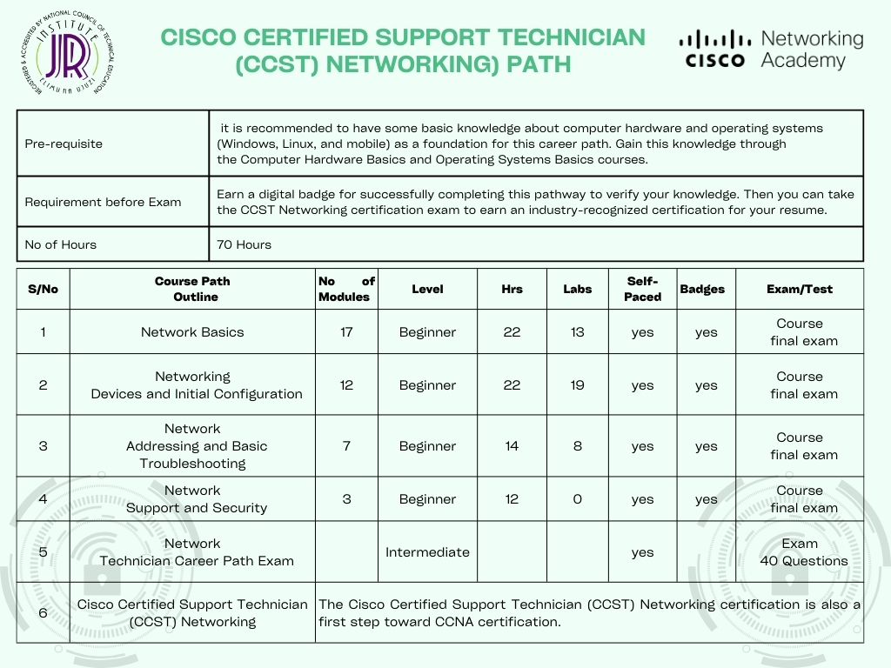
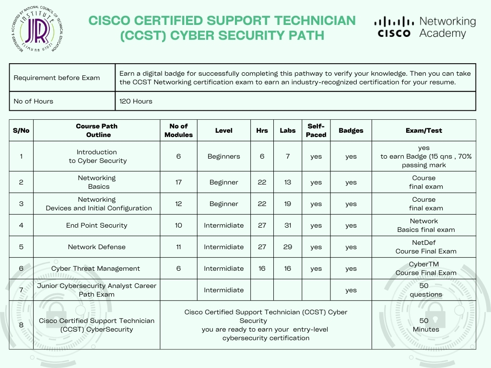

# JRIIT-Cisco-Courses
#  JR Institute of Information has partnered with Cisco Networking Academy which provides Online Self-Paced and Instructor-Led Courses.
 Whether you’re curious about tech or ready to build your career, find your fit with courses across foundational tech topics like Cybersecurity, Networking, Python, and Data Science. 
 Earn a digital badge for successfully completing pathway to verify your knowledge. Digital badges are the best tool to highlight your Cisco certifications and achievements on your online profiles, resumes and more. Join the group of Cisco certified professionals who are already sharing their skills this way. 
 Join the league of Cisco-certified professionals who are shaping the future of technology. Seize this opportunity to enrich your skill set and open doors to limitless possibilities.

 **For enrollement of Cisco Cources at our center [Click on the link](https://forms.gle/9yixeqht3C5uaXVZ7)**
 
**Choose your Path:**
1. **Become Cisco Certified Support Technician (CCST) - Networking** by following the path shown below. 
     
   

2. **Become Cisco Certified Support Technician (CCST) - Cyber Security** by following the path shown below. 
    
    

  **Other Courses are:**
  1. Operating Systems Basics 
  2. Computer Hardware Basics 
  3. Getting Started with Cisco Packet Tracer 
  4. Introduction to Data Science and Data Analytics
  5. Engaging Stakeholders for Success 
  6. Python Essentials 1 & 2

 **For enrollement of Cisco Cources at our center [Click on the link](https://forms.gle/9yixeqht3C5uaXVZ7)**
  **You can also all us  + +255 744 444 557  Dar es Salaam Campus +255 754  360  590 Arusha Campus,  
    or visit our Dar es Salaam Campus  4th Floor, Raha Towers,Opp Maktaba Kuu, Visit our Arusha Campus Sakina Area ,Namanga Road.**

    

