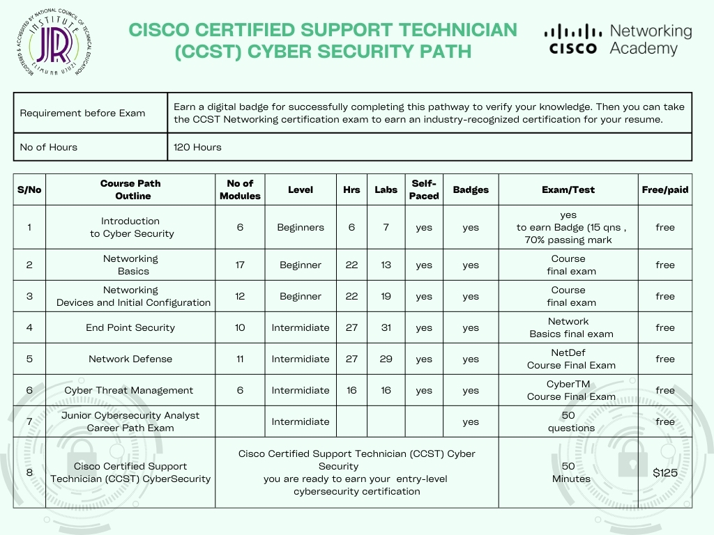

# JRIIT-Cisco-Courses
#  JR Institute of Information has patnered with Cisco Networking Academy which provides Self-Paced ,Online free Cources.
 Whether you’re curious about tech or ready to build your career, find your fit with courses across foundational tech topics like Cybersecurity, Networking, Python, and Data Science. 
 Earn a digital badge for successfully completing pathway to verify your knowledge. Digital badges are the best tool to highlight your Cisco certifications and achievements on your online profiles, resumes and more. Join the group of Cisco certified professionals who are already sharing their skills this way.
 Cisco partners with Credly to deliver its Professional badges through the Acclaim platform. Cisco’s Professional badge collection can be viewed on the Credly platform.

Choose your Path:
#  1. Become Cisco Certified Support Technician (CCST) - Netorking by following the path shown below
      
     You can start the first Course "Introduction of Cyber Security" [by clicking the link](https://skillsforall.com/course/introduction-to-cybersecurity?courseLang=en-US&instance_id=8d91886e-bc09-49ca-b0af-1bb816d49a00)
      
 # 2. Become Cisco Certified Support Technician (CCST) - Cyber Security  by following the path shown below
    
    You can start the first Course "Network Basics: [by clicking the link](https://skillsforall.com/course/networking-basics?courseLang=en-US&instance_id=657f9b59-7520-43c3-ab76-40cf2cb8e281)

  

    

